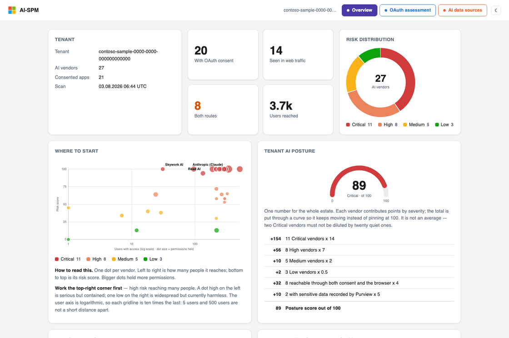

<div align="center">

# AI-SPM

**Find every AI application, agent and Shadow AI tool in your Microsoft 365 tenant —
and know which one to fix first.**

Read-only. Runs from your laptop in two minutes, or on a schedule in Azure.

[Quick start](#quick-start) · [Live sample](#see-it-before-you-run-it) ·
[Permissions](#permissions) · [Troubleshooting](#troubleshooting)

</div>

<div align="center">
  
</div>

---

## What it finds

| | |
| --- | --- |
| 🔑 **Consented AI apps** | Every third-party AI app holding an OAuth grant, and exactly which permissions |
| 🌐 **Shadow AI** | AI used through the browser — who, how much data, sanctioned or not |
| 🤖 **Agents** | Copilot agents and Entra agent identities, with owners and permissions |
| 🔒 **Sensitive data** | What Purview saw reaching AI, blocked versus allowed |

Everything lands on **one page**: one row per vendor, whichever route it came in by.
ChatGPT consented as an app *and* used in the browser is one row, not two. The two detail
dashboards are one click away, and every page carries the same three-way switch.

> **100% read-only.** AI-SPM never revokes a permission, deletes an app, or changes a
> setting. It observes, scores and reports — remediation stays with your team.

---

## Quick start

Pick the row that matches how far you want to go. Each one includes everything above it.

| | You get | You need | Time |
| --- | --- | --- | --- |
| **1 · Sign in** | Consented AI apps, permissions, usage | `az login` | 2 min |
| **2 · App registration** | **+ Shadow AI, agents, sensitive data** | One script, admin consent | 10 min |
| **3 · Deploy** | **+ daily scans, change history, email digest** | An Azure subscription | 20 min |

<br>

### 1 · Sign in — nothing to create

Works on your laptop, or in Azure Cloud Shell where `az` is already signed in.

```bash
git clone https://github.com/MSalikoc/ai-spm-shadow-ai.git && cd ai-spm-shadow-ai
```

```bash
pip install -r requirements.txt
```

```bash
az login
```

```bash
python3 aispm.py doctor
```

```bash
python3 aispm.py scan --open
```

Opens `out/portal.html`. A read-only directory role — **Global Reader** or **Security
Reader** — is enough.

> In Cloud Shell, use `download out/portal.html` to get the file to your browser.

**Only Entra sources connect in this mode.** That is not a licensing problem — see
[Why only Entra connects](#why-only-entra-connects). Step 2 fixes it.

<br>

### 2 · App registration — all four data sources

One script creates the registration, grants six read-only Graph permissions and consents
them. No Azure resources are created.

```bash
./scripts/create_app_registration.sh
```

It prints three `export` lines. Paste them, then:

```bash
python3 aispm.py doctor --auth app
```

```bash
python3 aispm.py scan --auth app --scope consented --open
```

Needs a role that can grant application permissions — **Privileged Role Administrator**
or **Global Administrator**.

<br>

### 3 · Deploy — continuous scanning

[](https://portal.azure.com/#create/Microsoft.Template/uri/https%3A%2F%2Fraw.githubusercontent.com%2FMSalikoc%2Fai-spm-shadow-ai%2Fmain%2Fdeploy%2Fazuredeploy.json)

Then in **Cloud Shell**, one block at a time:

```bash
git clone https://github.com/MSalikoc/ai-spm-shadow-ai.git && cd ai-spm-shadow-ai
```

```bash
RESOURCE_GROUP="aispm-rg"
```

```bash
FUNCTION_APP="aispm-xxxxxxxxxx"
```

```bash
./scripts/postdeploy.sh "$RESOURCE_GROUP" "$FUNCTION_APP"
```

That deploys the code, grants every Graph permission and turns the connectors on. Then:

```bash
KEY=$(az functionapp keys list -g "$RESOURCE_GROUP" -n "$FUNCTION_APP" --query functionKeys.default -o tsv)
```

```bash
curl -s "https://$FUNCTION_APP.azurewebsites.net/api/scan?code=$KEY" ; echo
```

```bash
echo "https://$FUNCTION_APP.azurewebsites.net/api/portal?code=$KEY"
```

Give it a few minutes — role propagation and the first scan both take a moment.

| Route | Serves |
| --- | --- |
| `/api/portal` | The portal — **start here** |
| `/api/report` | Entra OAuth assessment |
| `/api/connectors?format=html` | Microsoft AI data sources |
| `/api/doctor` | What the Managed Identity can read |
| `/api/scan` | Trigger a scan |

---

## See it before you run it

Rendered from a synthetic tenant, through the real scoring and charting code.

| | |
| --- | --- |
| **[▶ Portal](https://htmlpreview.github.io/?https://github.com/MSalikoc/ai-spm-shadow-ai/blob/main/docs/sample-portal.html)** | 27 AI vendors, 8 seen through two routes, and a week of drift |
| [Entra OAuth assessment](https://htmlpreview.github.io/?https://github.com/MSalikoc/ai-spm-shadow-ai/blob/main/docs/sample-report.html) | Per-application permissions and usage |
| [AI data sources](https://htmlpreview.github.io/?https://github.com/MSalikoc/ai-spm-shadow-ai/blob/main/docs/sample-connectors.html) | Agents, Shadow AI traffic, sensitive data |

Regenerate them with `python3 aispm.py sample`.

---

## How much to look at

The default assesses only apps matching the AI catalog — precise, but blind to any AI
vendor the catalog has not heard of.

```bash
python3 aispm.py scan --scope consented
```

| `--scope` | Assesses |
| --- | --- |
| `ai` *(default)* | Apps matching the AI catalog |
| `consented` | **+ every app holding a real OAuth grant** — the honest consent surface |
| `all` | Every third-party app |

Apps pulled in by scope rather than a catalog hit are tagged `ai_match: false`. Being in
scope is never dressed up as an AI detection.

On a deployment, set `AISPM_SCAN_SCOPE` instead.

---

## Scores you can check

No black boxes. Every score is a sum of named signals, and the page shows the
arithmetic — open any vendor row:

```
+18   424 people reached it through the browser
+20   29.8k MB uploaded to it
+15   Large volume leaving the tenant, spread across many people
+12   Marked unsanctioned in Defender for Cloud Apps
 65   Risk score out of 100
```

**Bands:** 75+ Critical · 50–74 High · 25–49 Medium · under 25 Low.

A DLP *block* scores nothing — that is the control working. Permission weights live in
[`config.py`](config.py); the AI catalog in [`catalog.json`](catalog.json), overridable
with `AISPM_CATALOG_PATH`.

---

## Permissions

All read-only. `create_app_registration.sh` and `postdeploy.sh` grant these for you.

| Permission | Unlocks | Needed |
| --- | --- | --- |
| `Application.Read.All` | App and service principal inventory | Always |
| `Directory.Read.All` | OAuth grants, owners | Always |
| `AuditLog.Read.All` | Usage and activity *(also needs Entra ID P1)* | Optional |
| `CloudApp-Discovery.Read.All` | Shadow AI web traffic | Optional |
| `CopilotPackages.Read.All` | Agent 365 catalogue | Optional |
| `AuditLogsQuery.Read.All` | Purview sensitive interactions | Optional |

### Why only Entra connects

With `az login` you get a **delegated** token, which can only carry Graph scopes the
*Azure CLI application* is authorised for. Directory reads are in that set — which is
why Entra discovery works. The three connector scopes are not, so they are simply
absent from the token. **Being Global Administrator does not change this**; the limit is
on the client application, not on your account.

`doctor` prints the scopes your token actually carries and says so directly:

```
[DENIED] Defender for Cloud Apps
         the sign-in does not carry this scope at all — the client application
         is not authorized for it, so no directory role will change this
```

Use option 2 or 3, both of which use application permissions instead.

---

## Configuration

Set by the setup scripts; listed for reference.

| Setting | Purpose |
| --- | --- |
| `AISPM_TENANT_ID` | Tenant to scan |
| `AISPM_SCAN_SCOPE` | `ai` / `consented` / `all` |
| `AISPM_ACTIVITY_DAYS` | Sign-in history window, 7–90 (default 90) |
| `AISPM_CATALOG_PATH` | Your own AI vendor catalog |
| `PURVIEW_AUDIT_DAYS`, `PURVIEW_POLL_SECONDS` | Purview window, and how long to wait for the search |
| `SCAN_SCHEDULE`, `EMAIL_SCHEDULE` | Timers (default: daily 06:00 UTC, Monday 08:00 UTC) |
| `STORE_RAW_AI_CONTENT` | Leave **off** — prompt/response text is never kept unless this is `true` |
| `AISPM_MAIL_SENDER`, `AISPM_MAIL_TO`, `AISPM_REPORT_URL` | Weekly email digest |

### Weekly email digest *(optional)*

Sent by the Managed Identity via Graph `sendMail` — no SMTP secrets. The full portal
travels as a single self-contained attachment, so every tab still works offline.

```bash
az functionapp config appsettings set -g "$RESOURCE_GROUP" -n "$FUNCTION_APP" --settings \
  AISPM_MAIL_SENDER="secops@contoso.com" \
  AISPM_MAIL_TO="team@contoso.com" \
  AISPM_REPORT_URL="https://$FUNCTION_APP.azurewebsites.net/api/portal?code=$KEY"
```

`Mail.Send` can send as any mailbox — restrict it to your sender with
[`New-ApplicationAccessPolicy`](https://learn.microsoft.com/en-us/powershell/module/exchange/new-applicationaccesspolicy).

---

## Troubleshooting

| Symptom | Cause | Fix |
| --- | --- | --- |
| `command not found: python` | macOS ships `python3` only | Use `python3` |
| `No module named 'azure'` | Wrong interpreter | `pip install -r requirements.txt` for that one |
| `Azure CLI is not installed` | No `az` | `brew install azure-cli`, or use `--auth app` |
| `no such file or directory: T` | A `<PLACEHOLDER>` pasted literally | Use the `export` lines the script prints |
| Only Entra sources connect | Delegated token limit | [See above](#why-only-entra-connects) — go to option 2 |
| A source shows `N/A` | Not provisioned in the tenant | A licensing question, not a permission one |
| Purview "still running" | Audit searches take minutes | Raise `PURVIEW_POLL_SECONDS` |
| Fewer apps than expected | Default scope is `ai` | `--scope consented` |
| Slow on a large tenant | Sign-in history window | `--activity-days 30` |

Not sure which? `python3 aispm.py doctor` — or `/api/doctor` on a deployment — reports
every source as readable, denied, or not provisioned, and names the permission to grant.

---

## How it works

```
aispm.py          CLI — doctor / scan / sample
preflight.py      "can this identity read X?" probes
pipeline.py       scan flow: discovery → permissions → activity → scoring
collectors.py     OAuth-consent discovery        scoring.py             risk scoring
connectors/       the four Microsoft data sources + correlation
portal.py         the unified estate view        charts.py              inline-SVG charts
report.py         Entra OAuth dashboard          connectors_report.py   AI data sources
drift.py          change tracking                findings.py            managed findings
function_app.py   Azure Function entry points    notify.py              weekly digest
```

The portal groups by **vendor**, not by ID. Defender's records carry no appId and no
domain, so nothing can merge them with the Entra side by identifier — forcing it would
invent a correlation the data cannot support. Both sides go through the same AI catalog
instead, and every row states how it was seen.

### Local testing

```bash
pip install -r requirements.txt pytest && pytest
```

CI runs the same checks on every pull request and before every deploy.

---

## Security & privacy

- **Read-only** — nothing is revoked, deleted or changed.
- **No stored secrets** on a deployment — Managed Identity only.
- **Your data stays in your tenant** — reports go to your own Storage account.
- **No raw AI content** — sensitive-interaction records keep metadata only, never
  prompt or response text, unless `STORE_RAW_AI_CONTENT` is explicitly turned on.

## License

MIT
