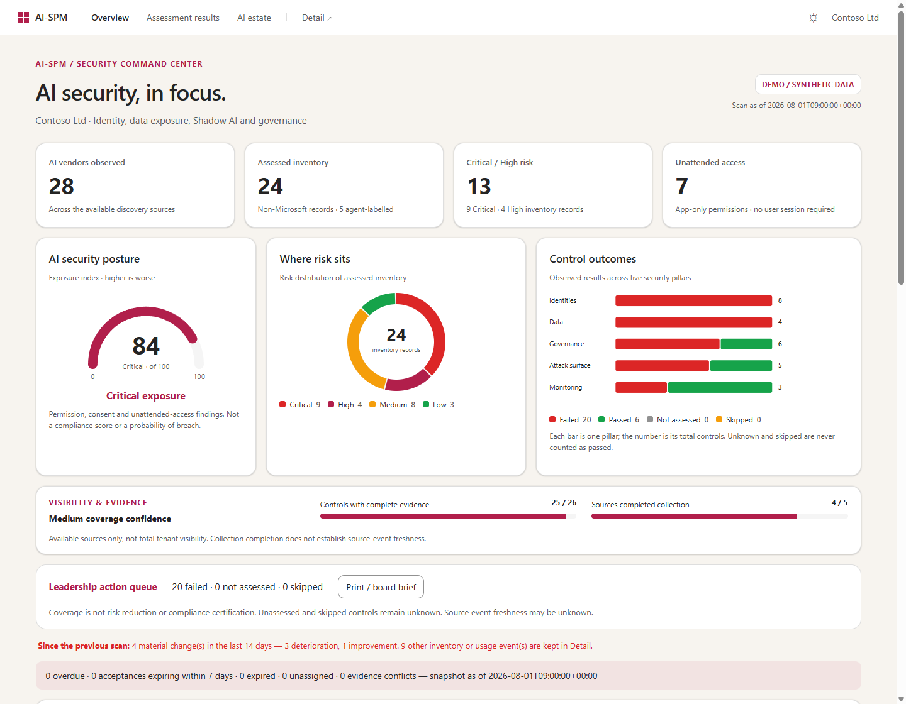
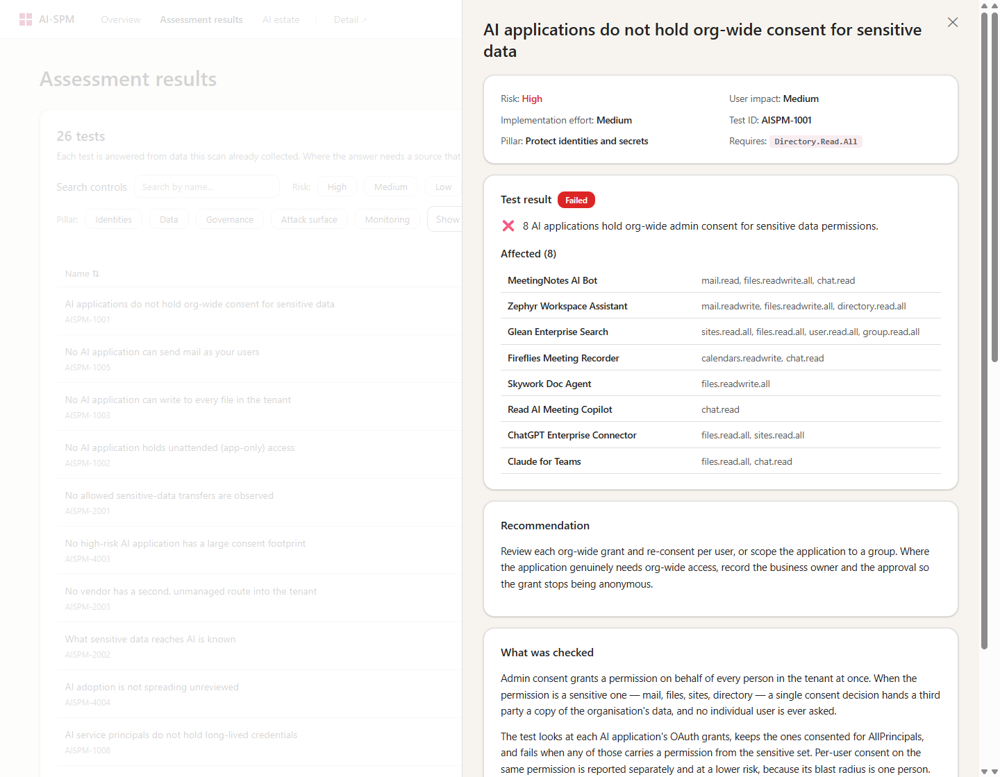

<div align="center">

# AI-SPM

**Discover AI applications, agents and Shadow AI evidence in your Microsoft 365 tenant —
and know which one to fix first.**

Read-only. Runs from your laptop in two minutes, or on a schedule in Azure.

[Quick start](#quick-start) · [Live sample](#see-it-before-you-run-it) ·
[Permissions](#permissions) · [Troubleshooting](#troubleshooting)

</div>

<div align="center">
  
</div>

---

## What it finds

| | |
| --- | --- |
|  **Consented AI apps** | Every third-party AI app holding an OAuth grant, and exactly which permissions |
|  **Shadow AI** | AI used through the browser — who, how much data, sanctioned or not |
|  **Agents** | Copilot agents and Entra agent identities, with owners and permissions |
|  **Sensitive data** | What Purview saw reaching AI, blocked versus allowed |

It opens as an **AI security dashboard**: observed vendors and inventory, Critical/High-risk
records, unattended access, an exposure gauge, risk distribution and stacked control
outcomes across five pillars. Graphs use the same scan data as the evidence tables;
unrated inventory, unassessed and skipped controls stay distinct from low risk or passed.
Control coverage and source collection are shown separately. The sample is explicitly
labelled synthetic, and every report carries its scan timestamp.

Below the charts, up to **three accountable decision programs** connect findings to
owners, due dates and time-bound risk acceptance. A failing test names the applications
that failed it and what to do about them.

The AI estate sits on the same page: one row per vendor, whichever route it came in by.
ChatGPT consented as an app *and* used in the browser is one row, not two.

Everything behind that answer — permissions, usage, governance, agents, observed traffic,
findings, changes and coverage — is on **one** detail page, one click away. Two pages in
total, and nothing is said on both.

> **100% read-only.** AI-SPM never revokes a permission, deletes an app, or changes a
> setting. It observes, scores and reports — remediation stays with your team.

---

## Quick start

Pick the row that matches how far you want to go. Each one includes everything above it.

| | You get | You need | Time |
| --- | --- | --- | --- |
| **1 · Sign in** | Consented AI apps, permissions, usage | `az login` | 2 min |
| **2 · App registration** | **+ Shadow AI, agents, sensitive data** | One script, admin consent | 10 min |
| **3 · Deploy** | **+ daily scans, change history, email digest** | An Azure subscription | 20 min |

<br>

### 1 · Sign in — nothing to create

Works on your laptop, or in Azure Cloud Shell where `az` is already signed in.

```bash
git clone https://github.com/MSalikoc/ai-spm-shadow-ai.git && cd ai-spm-shadow-ai
```

```bash
python3 -m pip install -r requirements.txt
```

```bash
az login
```

```bash
python3 aispm.py doctor
```

```bash
python3 aispm.py scan --open
```

Opens `out/assessment.html`. A read-only directory role — **Global Reader** or **Security
Reader** — is enough.

<details>
<summary><b>PowerShell / Windows</b></summary>

Windows usually has none of Git, Python or the Azure CLI. Install all three with winget
— it ships with Windows 10 and 11:

```powershell
winget install --id Git.Git -e
winget install --id Python.Python.3.12 -e
winget install --id Microsoft.AzureCLI -e
```

**Then close PowerShell and open a new window** — installers add to `PATH`, and the
session you ran them in will not see it. Check it took:

```powershell
git --version; python --version; az version
```

Then the same five steps. Windows has `python`, not `python3`:

```powershell
git clone https://github.com/MSalikoc/ai-spm-shadow-ai.git; cd ai-spm-shadow-ai
python -m pip install -r requirements.txt
az login
python aispm.py doctor
python aispm.py scan --open
```

`python -m pip` rather than `pip`, because a fresh Windows Python does not always put
`pip` itself on `PATH`.
</details>

> In Cloud Shell, use `download out/assessment.html` to get the file to your browser.

**Only Entra sources connect in this mode.** That is not a licensing problem — see
[Why only Entra connects](#why-only-entra-connects). Step 2 fixes it.

<br>

### 2 · App registration — additional Microsoft AI data sources

One script creates the registration and grants the supported read-only Graph application
permissions. Grant failures stop setup rather than being reported as success. Feature
licenses, telemetry ingestion and audit configuration remain separate prerequisites.
No Azure hosting resources are created.

```bash
./scripts/create_app_registration.sh
```

It prints three `export` lines. Paste them, then:

```bash
python3 aispm.py doctor --auth app
```

```bash
python3 aispm.py scan --auth app --scope consented --open
```

<details>
<summary><b>PowerShell / Windows</b></summary>

Use the PowerShell twin — it does the same work through the Azure CLI, so there is no
extra module to install, and it prints `$env:` lines instead of `export` ones.

```powershell
.\scripts\create_app_registration.ps1
```

```powershell
python aispm.py doctor --auth app
python aispm.py scan --auth app --scope consented --open
```

Setting the credentials by hand instead:

```powershell
$env:AISPM_TENANT_ID = "<TENANT>"
$env:AISPM_CLIENT_ID = "<APP_ID>"
$env:AISPM_CLIENT_SECRET = "<SECRET>"
```
</details>

### Who can run this

Creating the registration and consenting its permissions both write to the directory, so
this needs **Privileged Role Administrator** or
**Global Administrator**.

**Global Reader is not enough.** It is read-only — it runs option 1 perfectly well, but
cannot create the registration or consent the permissions.

An `az login` token may still *list* scopes like `Application.ReadWrite.All`. Those
describe what the Azure CLI is allowed to ask for on your behalf, not what your directory
role permits, so seeing them is not evidence you can complete this step.

If you are a Global Reader: an admin runs the script once and gives you the three values
it prints. Nothing else about your setup changes — you keep running the scans.

<br>

### 3 · Deploy — continuous scanning

[](https://portal.azure.com/#create/Microsoft.Template/uri/https%3A%2F%2Fraw.githubusercontent.com%2FMSalikoc%2Fai-spm-shadow-ai%2Fmain%2Fdeploy%2Fazuredeploy.json)

Then in **Cloud Shell**, one block at a time:

```bash
git clone https://github.com/MSalikoc/ai-spm-shadow-ai.git && cd ai-spm-shadow-ai
```

```bash
RESOURCE_GROUP="aispm-rg"
```

```bash
FUNCTION_APP="aispm-xxxxxxxxxx"
```

```bash
./scripts/postdeploy.sh "$RESOURCE_GROUP" "$FUNCTION_APP"
```

That deploys the code, grants every Graph permission and turns the connectors on. Then:

```bash
KEY=$(az functionapp keys list -g "$RESOURCE_GROUP" -n "$FUNCTION_APP" --query functionKeys.default -o tsv)
```

```bash
curl -s "https://$FUNCTION_APP.azurewebsites.net/api/scan?code=$KEY" ; echo
```

```bash
echo "https://$FUNCTION_APP.azurewebsites.net/api/assessment?code=$KEY"
```

Give it a few minutes — role propagation and the first scan both take a moment.

<details>
<summary><b>PowerShell / Windows</b></summary>

`postdeploy.sh` is a Bash script, so run **step 3 in Cloud Shell's Bash** — it is a
dropdown at the top of the Cloud Shell window, and `az` is already signed in there.

Once deployed, the follow-up commands from PowerShell:

```powershell
$RG = "aispm-rg"; $FUNC = "aispm-xxxxxxxxxx"
$KEY = az functionapp keys list -g $RG -n $FUNC --query functionKeys.default -o tsv
Invoke-RestMethod "https://$FUNC.azurewebsites.net/api/scan?code=$KEY"
Start-Process "https://$FUNC.azurewebsites.net/api/assessment?code=$KEY"
```

`curl` in PowerShell is an alias for `Invoke-WebRequest` and does not take `-s`; use
`Invoke-RestMethod`, or `curl.exe` if you want the real thing.
</details>

| Route | Serves |
| --- | --- |
| `/api/assessment` | The assessment and the AI estate — **start here** |
| `/api/detail` | Everything behind it, on one page |
| `/api/doctor` | What the Managed Identity can read |
| `/api/scan` | Trigger a scan |
| `/api/decisions` | Read or update CISO decision ownership, status, due dates and exceptions |

Decision workflow records live in the report storage account; they never change tenant
configuration. A risk acceptance must name an owner, approver, rationale and future
expiry:

```bash
curl -X POST "https://$FUNCTION_APP.azurewebsites.net/api/decisions" \
  -H "x-functions-key: $KEY" \
  -H "Content-Type: application/json" \
  -d '{"decision_key":"governance","status":"Risk accepted","owner":"CISO","acceptance":{"rationale":"Ownership programme funded and in progress","approved_by":"CISO","expires_at":"2026-12-31"}}'
```

On the deployed HTTPS `/api/assessment` page, **Review / edit decision** records owner,
status, due date, notes, compensating controls and time-bound acceptance. The page loads
`GET /api/decisions` and refreshes after a save without requiring a new scan. The scan
evidence and **scan-as-of** remain unchanged; **workflow-as-of** identifies the separate
current read. **Review all three programs** includes programs absent from the scan's
decision cards. Refresh workflow to see other editors' updates.

The function key is used only in the same-origin request header, held in memory, and
never copied into links or browser storage. A `code` parameter on the live page is
removed from the address bar after loading; it may already have appeared in server
logs/history from the initial navigation. Alternatively enter the key in the page.
Downloaded, sample, email and local HTTP pages are **read-only snapshots**; they do not
attempt localhost saves. Static HTML/JSON and email attachments refresh on the next
scan, not on a workflow save. Detail-page access may require separate authentication;
the editor does not propagate its key to navigation links.

`GET /api/decisions` returns all three records with `persisted` and an opaque `revision`.
Defaults with `persisted: false` do not create active programs. Pass that decision's
`expected_revision` on POST to protect an editor's read: a same-decision change returns
**409** without overwriting it; reload and review the draft. Different-program concurrent
writes merge using the existing Azure ETag / local file lock. Omitting the revision
remains supported for older clients, **without stale-editor protection**. GET returns
**503** with `store_status: corrupt` or `unavailable` rather than reporting stale state
as current; the UI disables saving until a successful reload.

Date-only due dates and acceptance expiries are inclusive through the end of that UTC
calendar date; timestamps take effect at the exact instant specified. Open decisions,
overdue work, expired acceptances and invalid workflow records remain visible even when
their program has no current failed controls. Invalid stored data is reported rather than
overwritten. Owner and `approved_by` are **self-reported under shared function-key
authentication**, not authenticated individual identities or signed approvals; change
history is not a tamper-proof audit log.

A manually **Verified** program with failed scan controls shows **Verification needs
review** and a derived `evidence_conflict` in assessment HTML/JSON, without changing the
record or history. The attention strip counts active programs that are overdue, have
acceptances expiring within seven days (inclusive), expired, unassigned or conflicting.
Coverage confidence describes connector/control completeness, **not source freshness,
probabilistic evidence quality or compliance certification**. Collection/check times
are not source event timestamps. Consent-user counts are not unique or tenant-wide reach.
**Print / board brief** uses browser print with scan-as-of and limitations; it is not a
new export service. Expand detailed coverage or open Assessment results for all 26 controls.

Browser regression checks use installed Chrome and Node's built-in WebSocket (Node 22+
with global WebSocket), without new dependencies:
`node tests\browser_workflow.mjs`. The harness intercepts all page traffic with synthetic
API responses; it never writes to a tenant. `--screenshots` also refreshes the README
image from the real generated sample (run `python aispm.py sample` first).

---

## See it before you run it

Rendered from a synthetic tenant, through the real scoring and charting code.

| | |
| --- | --- |
| **[▶ Assessment](https://htmlpreview.github.io/?https://github.com/MSalikoc/ai-spm-shadow-ai/blob/main/docs/sample-assessment.html)** | 26 tests and 27 AI vendors — what to fix, worst first, each with its affected applications |
| [Detail](https://htmlpreview.github.io/?https://github.com/MSalikoc/ai-spm-shadow-ai/blob/main/docs/sample-detail.html) | Permissions, usage, governance, agents, traffic, findings, changes, coverage |

<div align="center">
  
  <br>
  <sub>Open a test and it names the applications that failed it, with the permission that
  failed them.</sub>
</div>

Regenerate them with `python3 aispm.py sample`.

---

## Reading the results

Only apps matching the AI catalog are assessed by default — precise, but blind to any
vendor the catalog has not heard of. Widen it with `--scope consented` (every app holding
a real OAuth grant) or `--scope all`. Apps pulled in by scope rather than a catalog hit
are tagged `ai_match: false`; being in scope is never dressed up as an AI detection.

Every score is a sum of named signals, and the page shows the arithmetic — open any
vendor row:

```
+18   424 people reached it through the browser
+20   29.8k MB uploaded to it
+15   Large volume leaving the tenant, spread across many people
+12   Marked unsanctioned in Defender for Cloud Apps
 65   Risk score out of 100
```

**Bands:** 75+ Critical · 50–74 High · 25–49 Medium · under 25 Low. A DLP *block* scores
nothing — that is the control working.

---

## Permissions

The scanner's data-reading roles are requested by `create_app_registration.sh` (or its
PowerShell twin) and `postdeploy.sh`. A successful grant is not proof that the feature
is licensed or that it has produced data. Microsoft Graph application-role consent
requires Privileged Role Administrator, Global Administrator, or a suitable custom
role; Cloud Application Administrator alone is not sufficient.

| Permission | Unlocks |
| --- | --- |
| `Application.Read.All`, `Directory.Read.All` | App inventory, OAuth grants, owners — **required** |
| `AuditLog.Read.All` | Usage and activity *(also needs Entra ID P1)* |
| `CloudApp-Discovery.Read.All` | Shadow AI web traffic |
| `CopilotPackages.Read.All` | Agent 365 catalogue |
| `AgentIdentity.Read.All`, `AgentIdentityBlueprint.Read.All` | Entra agent identities and blueprint inventory |
| `AuditLogsQuery.Read.All` | Purview sensitive interactions |

Agent 365 requires the applicable Agent 365 license. Defender requires Cloud Discovery
ingestion as well as licensing. Purview requires auditing and relevant events; some
non-Microsoft AI auditing scenarios also require pay-as-you-go configuration. The
Defender and expanded sign-in APIs use Graph beta contracts.

Sponsor reads are optional: the current Agent ID sponsor API documents a write-capable
permission. Setup does **not** automatically grant it. Unavailable sponsor evidence must
not be interpreted as an agent having no sponsor. `ENABLE_ENTRA_AGENT_SPONSORS=true`
opts into these reads only after an administrator has separately approved the required
access; leave it unset for the default read-only scanner.

The deployment also grants `Mail.Send` for the optional digest. It is not a data-reading
permission; restrict it to the sender mailbox as described in the email setup. The
scanner never changes tenant access controls, but it can create audit-search jobs,
send configured digests, and persist its own governance records.

### Evidence completeness

Core discovery and permission-read failures stop the scan, preserving the previous
report instead of publishing a falsely clean inventory. Optional ownership/activity
failures are marked incomplete. Failed batch items, missing pages and sign-in row limits
cannot establish absence of permissions, credentials, owners or activity.

Standard Graph sign-in access provides at most a **30-day retained window**, not a
90-day history. Only successful user and service-principal sign-ins establish use;
non-interactive user events are included. A shorter collection window cannot establish
30-day inactivity, and no events in the retained window does not mean "never used".
90-day metrics stay unavailable without a separately implemented historical source.

Partial connector evidence can retain a known finding, but cannot prove a clean control
or count as complete control coverage. Sensitive-sharing findings require sensitivity
and an allowed transfer in the **same event**; an unrelated upload and a blocked
sensitive event are not evidence of a leak. DSPM import files are snapshots, not a live
collection channel, and old events do not become recent just because they were imported.
Timed-out Purview queries are resumed using tenant-scoped, versioned checkpoints. Live
entry points take the checkpoint tenant from the acquired token, never from an unrelated
environment setting. If the token's tenant cannot be determined, checkpoint persistence
is explicitly disabled.

### Why only Entra connects

With `az login` you get a **delegated** token, which can only carry Graph scopes the
*Azure CLI application* is authorised for. Directory reads are in that set — which is
why Entra discovery works. The three connector scopes are not, so they are simply absent
from the token. **Being Global Administrator does not change this**; the limit is on the
client application, not on your account. Option 2 or 3 fixes it — both use application
permissions instead.

---

## Troubleshooting

Start with `python3 aispm.py doctor` (or `/api/doctor`). It reports every source as
readable, denied, or not provisioned, and names the permission to grant.

| Symptom | Fix |
| --- | --- |
| `command not found: python` | macOS ships no bare `python` — use `python3` (Windows uses `python`) |
| Windows: `python` is not recognised, or opens the Microsoft Store | Python is not installed — `winget install --id Python.Python.3.12 -e`, then **open a new PowerShell window** |
| Windows: `pip` is not recognised | Use `python -m pip` — a fresh Windows Python does not always put `pip` on `PATH` |
| Windows: `git`/`az` not recognised right after installing | `PATH` only updates for new sessions — close and reopen PowerShell |
| `Could not determine the tenant` even though `az login` worked | Fixed in current `main` — `git pull`. If it persists, pass `--tenant <ID>` (`az account show --query tenantId -o tsv`) |
| `curl: -s is not recognised` | PowerShell aliases `curl` to `Invoke-WebRequest` — use `Invoke-RestMethod`, or `curl.exe` |
| `.ps1 cannot be loaded` | `Set-ExecutionPolicy -Scope Process RemoteSigned`, then re-run |
| `No module named 'azure'` | `python3 -m pip install -r requirements.txt` — and make sure it is the same interpreter you run `aispm.py` with |
| `Azure CLI is not installed` | `brew install azure-cli`, or use `--auth app` |
| `no such file or directory: T` | A `<PLACEHOLDER>` pasted literally — use the `export` lines the script prints |
| Only Entra sources connect | [See above](#why-only-entra-connects) — go to option 2 |
| Option 2 fails partway with `Insufficient privileges` | Your role cannot grant application permissions — see [Who can run this](#who-can-run-this) |
| Windows PowerShell 5.1: `The string is missing the terminator` | Fixed in current `main` — `git pull` |
| A source shows `N/A` | Inspect the returned endpoint error, permissions, licensing and provisioning; this status alone does not identify the cause |
| Purview "still running" | Audit searches take minutes — raise `PURVIEW_POLL_SECONDS` |
| Fewer apps than expected | Default scope is `ai` — use `--scope consented` |
| Slow on a large tenant | `--activity-days 30` |

---

## Configuration

Set by the setup scripts. Change these on a deployment with
`az functionapp config appsettings set`.

| Setting | Purpose |
| --- | --- |
| `AISPM_SCAN_SCOPE` | `ai` / `consented` / `all` |
| `AISPM_ACTIVITY_DAYS` | Sign-in history window, 7–30 (default 30; larger requests are capped) |
| `AISPM_CATALOG_PATH` | Your own AI vendor catalog |
| `PURVIEW_POLL_SECONDS` | How long to wait for a Purview audit search (default 300) |
| `SCAN_SCHEDULE`, `EMAIL_SCHEDULE` | Timers — daily 06:00 UTC, Monday 08:00 UTC |
| `STORE_RAW_AI_CONTENT` | Leave **off**; prompt and response text is never kept unless this is `true` |
| `AISPM_MAIL_SENDER`, `AISPM_MAIL_TO`, `AISPM_REPORT_URL` | Weekly email digest — sent by the Managed Identity via Graph, with the assessment attached as one self-contained file |

---

## Security & privacy

- **Read-only against Microsoft 365.** Nothing is revoked, deleted or changed in the
  tenant. Ownership and risk-decision records are written only to the product's report
  storage account.
- **No stored secrets** on a deployment — Managed Identity only.
- **Your data stays in your tenant** — reports go to your own Storage account.
- **No raw AI content.** Sensitive-interaction records keep metadata only, never prompt
  or response text, unless `STORE_RAW_AI_CONTENT` is explicitly turned on.

Contributions welcome — `pytest` runs the full suite, and CI runs it on every pull
request.

## License

MIT
